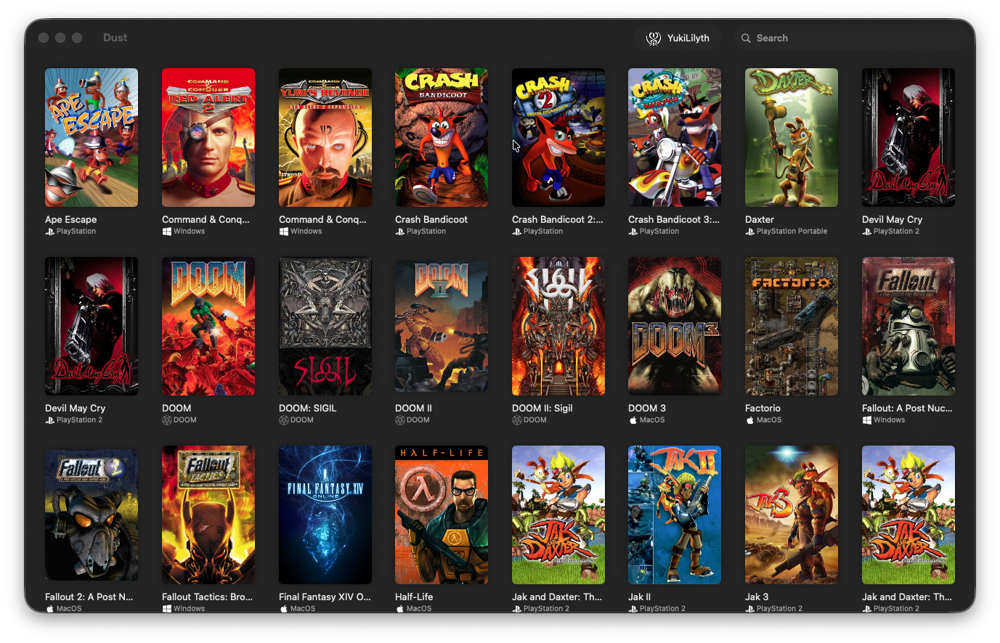
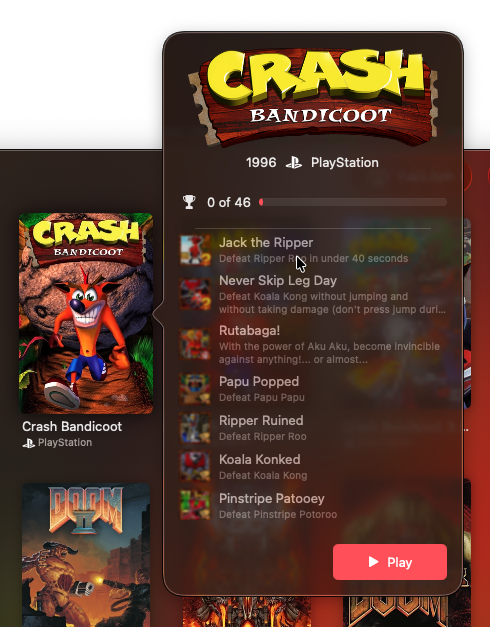
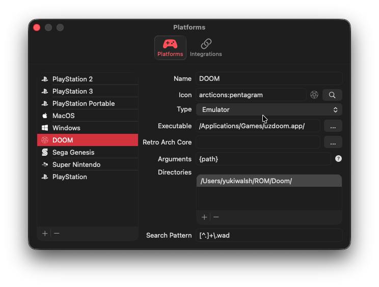

# Dust

Dust is a basic game launcher for MacOS, written in Swift for optimal performance on apple silicon.

## Features
- [Steam Grid DB](https://www.steamgriddb.com) integration for fetching cover, logo, and hero artwork.
- [Retro Achievements](tps://retroachievements.org) integration for basic achievement display.
- [Iconify](https://iconify.design) integration for fetching platform icons.
- Set up multiple platforms that point to emulators or application folders.

